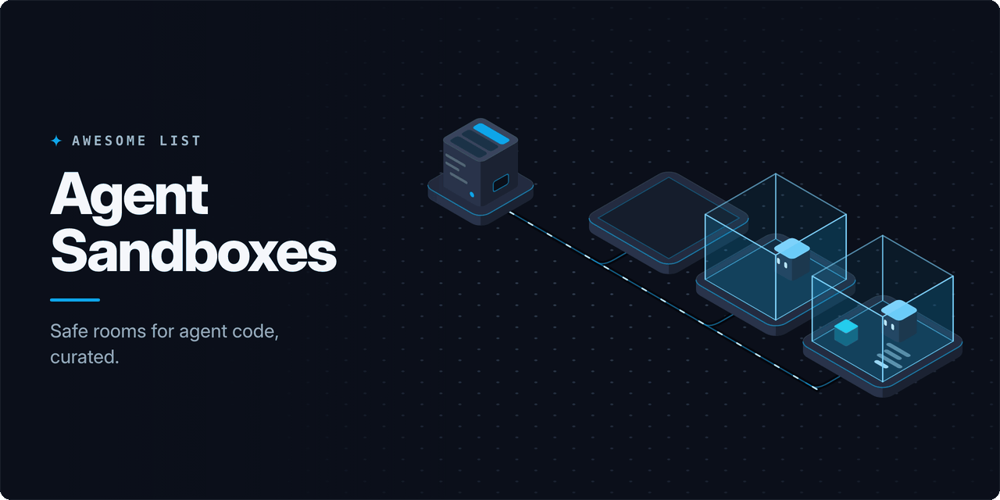

<!-- awesome:hero --><!-- /awesome:hero -->

<!-- awesome:title --><h1 align="center">Awesome Agent Sandboxes</h1><!-- /awesome:title -->

<!-- awesome:tagline -->Sandboxes, isolated runtimes and secure execution environments where AI agents run code and browse safely.<!-- /awesome:tagline -->

<!-- awesome:badges -->

  
  
  

<!-- /awesome:badges -->

An agent sandbox is an isolated place where an AI agent can run code, use a shell or drive a browser without reaching the host, its files or its secrets. This list covers hosted sandbox clouds, sandboxes built into agents and model APIs, self-hosted platforms, local tools for coding agents, code interpreters, and the isolation technology underneath them.

## Contents

- [Hosted sandboxes](#hosted-sandboxes)
- [Built into agents and model APIs](#built-into-agents-and-model-apis)
- [Self-hosted platforms](#self-hosted-platforms)
  - [Sandbox servers](#sandbox-servers)
  - [Kubernetes](#kubernetes)
- [Local sandboxes for coding agents](#local-sandboxes-for-coding-agents)
  - [Process sandboxes](#process-sandboxes)
  - [Containers and VMs](#containers-and-vms)
- [Code interpreters and language sandboxes](#code-interpreters-and-language-sandboxes)
- [Browser and desktop sandboxes](#browser-and-desktop-sandboxes)
- [SDKs and orchestration](#sdks-and-orchestration)
- [Isolation building blocks](#isolation-building-blocks)
- [Guides and research](#guides-and-research)
- [Related lists](#related-lists)
- [Contributing](#contributing)

## Hosted sandboxes

- [AgentBay](https://www.alibabacloud.com/en/product/agentbay) - Alibaba Cloud runtime with Linux, Windows, Android and browser sandboxes for agents.
- [Beam Sandboxes](https://www.beam.cloud/sandbox) - Python-driven cloud sandboxes with snapshots, GPUs and exposed ports.
- [Blaxel](https://blaxel.ai/platform/sandboxes) - Persistent microVM sandboxes that suspend when idle and resume with memory intact.
- [Cloudflare Sandbox SDK](https://github.com/cloudflare/sandbox-sdk) - Runs code in isolated containers on Cloudflare's network, driven from a Worker.
- [CodeSandbox SDK](https://github.com/codesandbox/codesandbox-sdk) - SDK that starts and controls CodeSandbox microVMs for running AI-generated code.
- [Daytona](https://www.daytona.io) - Hosted sandboxes for AI-generated code with quick starts and stateful pause and resume.
- [Deno Sandbox](https://deno.com/deploy/sandbox) - Linux microVMs on Deno Deploy with network policies and isolated secrets.
- [E2B](https://e2b.dev) - Firecracker sandbox cloud with Python and JavaScript SDKs for code that agents run.
- [Freestyle](https://www.freestyle.sh) - Full Linux VMs that agents get for running code you did not write.
- [Hopx](https://hopx.ai) - Linux micro-VMs that start in milliseconds for agents running Python, JavaScript or Go.
- [InstaVM](https://instavm.io) - Firecracker microVM sandboxes for agents with egress control and observability.
- [Modal Sandboxes](https://modal.com/docs/guide/sandboxes) - Containers created from code on Modal, with GPUs, snapshots and network controls.
- [Morph Cloud](https://www.morph.so) - Agent environments that branch a running VM into copies and scale out in bursts.
- [Northflank Sandboxes](https://northflank.com/product/sandboxes) - Kata and gVisor sandboxes on Northflank's cloud or in your own cloud account.
- [Novita Sandbox](https://novita.ai/sandbox) - Cloud runtimes with a filesystem, browser access and computer use for agents.
- [Riza](https://riza.io) - Isolated runtime API that executes untrusted code written by an LLM.
- [Runloop](https://runloop.ai) - Devboxes for coding agents with snapshots, repository connections and benchmarks.
- [Sprites](https://fly.io/sprites) - Persistent Firecracker VMs from Fly.io with checkpoint and restore.
- [Tensorlake](https://www.tensorlake.ai) - Firecracker sandboxes for LLM-generated code that scale from one to thousands.
- [Together Sandbox](https://www.together.ai/sandbox) - VMs with snapshots, resizable CPU and memory, and persistent storage for agents.
- [Vercel Sandbox](https://vercel.com/docs/sandbox) - Ephemeral Firecracker microVMs on Vercel for running untrusted or generated code.

## Built into agents and model APIs

- [Amazon Bedrock AgentCore Code Interpreter](https://docs.aws.amazon.com/bedrock-agentcore/latest/devguide/code-interpreter-tool.html) - Managed AWS sandbox where agents run Python, JavaScript and TypeScript.
- [Azure Container Apps dynamic sessions](https://learn.microsoft.com/en-us/azure/container-apps/sessions) - Hyper-V isolated sessions on Azure for running code that an LLM generated.
- [Claude code execution tool](https://platform.claude.com/docs/en/agents-and-tools/tool-use/code-execution-tool) - API tool that lets Claude run Bash and Python in a sandboxed container.
- [Claude Code sandboxing](https://code.claude.com/docs/en/sandboxing) - Filesystem and network isolation for the commands Claude Code runs on macOS and Linux.
- [Codex sandboxing](https://learn.chatgpt.com/docs/sandboxing) - How the Codex agent limits file writes and network access for the commands it runs.
- [Cursor terminal sandbox](https://cursor.com/docs/agent/tools/terminal) - Runs Cursor agent commands in a sandbox that limits file writes and network access.
- [Gemini API code execution](https://ai.google.dev/gemini-api/docs/code-execution) - Lets Gemini write and run Python in a Google-hosted sandbox.
- [Gemini CLI sandboxing](https://geminicli.com/docs/cli/sandbox/) - Runs Gemini CLI tools under macOS Seatbelt or inside a Docker or Podman container.
- [OpenAI code interpreter](https://developers.openai.com/api/docs/guides/tools-code-interpreter) - Responses API tool that runs Python in a sandboxed container.
- [OpenHands sandboxes](https://docs.openhands.dev/openhands/usage/sandboxes/overview) - Where the OpenHands agent runs code: a Docker sandbox, a local process or a remote host.

## Self-hosted platforms

### Sandbox servers

- [Agent-Sandbox](https://github.com/agent-sandbox/agent-sandbox) - Self-hosted runtime with per-agent and per-user sandboxes that keep state across turns.
- [AgentENV](https://github.com/kvcache-ai/AgentENV) - Runs large fleets of Firecracker agent environments, built for agentic RL training.
- [bhatti](https://github.com/sahil-shubham/bhatti) - MicroVM orchestrator with its own VMM that pauses idle sandboxes and wakes them fast.
- [Bouvet](https://github.com/vrn21/bouvet) - MCP server that runs agent code in short-lived Firecracker microVMs.
- [cocoon sandbox](https://github.com/cocoonstack/sandbox) - MicroVM sandboxes with warm pools, snapshot clones and Go and Python SDKs.
- [CubeSandbox](https://github.com/TencentCloud/CubeSandbox) - Tencent's KVM sandbox service with an E2B-compatible API and copy-on-write snapshots.
- [Dormice](https://github.com/BitMiracle-AI/Dormice) - E2B-compatible platform on your own machines whose gVisor sandboxes freeze when idle.
- [E2B runtime](https://github.com/e2b-dev/runtime) - The infrastructure behind E2B, for running its sandboxes on your own machines.
- [forkd](https://github.com/deeplethe/forkd) - Firecracker runtime that forks many child microVMs from one warm parent snapshot.
- [Judge0](https://github.com/judge0/judge0) - Sandboxed code execution server for many languages, used by people and AI tools.
- [k7](https://github.com/Katakate/k7) - Self-hosted Kata VM sandboxes for untrusted code, with a CLI, an API and a Python SDK.
- [LibreChat Code Interpreter](https://github.com/LibreChat-AI/code-interpreter) - Sandboxed code execution API behind LibreChat's code interpreter.
- [OpenSandbox](https://github.com/opensandbox-group/OpenSandbox) - Sandbox runtime for agents, evaluations and RL training, with SDKs in several languages.
- [sandbox0](https://github.com/sandbox0-ai/sandbox0) - Persistent, encrypted gVisor sandboxes for long-running agents, scheduled by Nomad.
- [SWE-ReX](https://github.com/SWE-agent/SWE-ReX) - Runtime interface that lets one agent drive shells locally, in Docker, on AWS or on Modal.
- [Zeroboot](https://github.com/zerobootdev/zeroboot) - VM sandboxes for agents created in under a millisecond by copy-on-write forking.

### Kubernetes

- [DAM](https://github.com/dam-agents/dam) - Runs agents in isolated Kubernetes pods with credential isolation and scheduled triggers.
- [GKE Agent Sandbox](https://docs.cloud.google.com/kubernetes-engine/docs/how-to/agent-sandbox) - Google Cloud guide to isolating AI code execution with Agent Sandbox on GKE.
- [k8e](https://github.com/xiaods/k8e) - Single binary that turns a Linux host into a gVisor, Kata or Firecracker agent sandbox cluster.
- [kars](https://github.com/Azure/kars) - Microsoft's Kubernetes stack that gives each agent a hardened sandbox and brokered calls.
- [Kubernetes Agent Sandbox](https://github.com/kubernetes-sigs/agent-sandbox) - Kubernetes API for isolated, stateful, single-pod workloads such as agent runtimes.
- [netclode](https://github.com/angristan/netclode) - Self-hosted cloud coding agent on k3s that runs each session in a Kata microVM.
- [OpenKruise Agents](https://github.com/openkruise/agents) - Kubernetes operator that manages the lifecycle of agent sandboxes.
- [sandbox-operator](https://github.com/cocoonstack/sandbox-operator) - Kubernetes apiserver and E2B-compatible data plane for warm-pooled microVM sandboxes.
- [treadstone](https://github.com/earayu/treadstone) - Kubernetes sandbox platform with code execution, a shell, files and a browser per sandbox.

## Local sandboxes for coding agents

### Process sandboxes

- [Agent Safehouse](https://github.com/eugene1g/agent-safehouse) - macOS Seatbelt profiles that let local agents read and write only what they need.
- [agent-sandbox.nix](https://github.com/archie-judd/agent-sandbox.nix) - Declarative Nix wrappers that sandbox agents on Linux and macOS.
- [agentsh](https://github.com/canyonroad/agentsh) - Policy-enforced shell for agents that checks and audits each command.
- [ai-jail](https://github.com/akitaonrails/ai-jail) - Sandbox for agents built on bubblewrap and Landlock on Linux and Seatbelt on macOS.
- [alcless](https://github.com/AkihiroSuda/alcless) - Runs agent shell commands or Homebrew as a separate macOS user to protect the host.
- [cplt](https://github.com/navikt/cplt) - Kernel-enforced sandbox that wraps Copilot CLI, Claude Code, Gemini CLI and other agents.
- [fence](https://github.com/fencesandbox/fence) - Container-free command sandbox with network and filesystem rules.
- [Greywall](https://github.com/GreyhavenHQ/greywall) - Deny-by-default sandbox that limits files, network and syscalls with kernel controls.
- [hazmat](https://github.com/dredozubov/hazmat) - macOS agent containment with user isolation, network controls and rollback.
- [nono](https://github.com/nolabs-ai/nono) - Kernel-enforced sandbox with a credential proxy, audit and rollback for agents.
- [OpenShell](https://github.com/NVIDIA/OpenShell) - NVIDIA runtime that confines autonomous agents with Landlock, seccomp and policies.
- [pi-sandbox](https://github.com/carderne/pi-sandbox) - OS-level sandbox for the pi agent with interactive permission prompts.
- [Sandbox Runtime](https://github.com/anthropics/sandbox-runtime) - Anthropic's tool that limits a process's files and network without a container.
- [sandlock](https://github.com/multikernel/sandlock) - Unprivileged Landlock and seccomp sandbox for agent processes on Linux.
- [SandVault](https://github.com/webcoyote/sandvault) - Runs agents as a separate macOS user under sandbox-exec.

### Containers and VMs

- [agentbox](https://github.com/madarco/agentbox) - Runs several coding agents in parallel sandboxed VMs, on your machine or in the cloud.
- [BoxLite](https://github.com/boxlite-ai/boxlite) - Embeddable micro-VM for agents that runs on a laptop or scales out on servers.
- [Brig](https://github.com/brig-sh/brig) - CLI and session daemon that run coding agents in a microVM sandbox.
- [brood-box](https://github.com/stacklok/brood-box) - CLI that runs coding agents inside hardware-isolated microVMs.
- [clampdown](https://github.com/89luca89/clampdown) - Runs AI coding agents in hardened container sandboxes.
- [cleanroom](https://github.com/buildkite/cleanroom) - Buildkite's policy-controlled microVM sandboxes for repository workloads.
- [CodeRunner](https://github.com/instavm/coderunner) - Local sandbox for agent code on macOS that runs in Apple containers, reached over MCP.
- [coi](https://github.com/coipond/coi) - Gives each coding agent its own Incus system container with root, systemd and Docker.
- [Docker Sandboxes](https://docs.docker.com/ai/sandboxes/) - Docker microVMs that run coding agents like Claude Code and Codex in isolation.
- [Gondolin](https://github.com/earendil-works/gondolin) - Linux microVM setup with a TypeScript control plane for sandboxing agents.
- [Leash](https://github.com/strongdm/leash) - StrongDM tool that wraps coding agents in containers and enforces Cedar policies.
- [Matchlock](https://github.com/jingkaihe/matchlock) - CLI that runs agents in microVMs with network allowlists.
- [microsandbox](https://github.com/superradcompany/microsandbox) - Local-first microVM runtime and library for running untrusted code.
- [sandcat](https://github.com/VirtusLab/sandcat) - Dev container setup that routes agent traffic through a proxy that injects secrets.
- [shuru](https://github.com/superhq-ai/shuru) - Local-first microVM sandbox for running agents on macOS and Linux.
- [smolvm](https://github.com/smol-machines/smolvm) - Embeddable, portable VM that can be branched, for running agents locally.
- [vibe](https://github.com/lynaghk/vibe) - Linux VMs on macOS for sandboxing LLM agents with little setup.
- [yolobox](https://github.com/finbarr/yolobox) - Runs agents in a container with your home directory left out.

## Code interpreters and language sandboxes

- [agentOS](https://github.com/rivet-dev/agentos) - Linux-compatible VM runtime used as a library to isolate agent files, processes and network.
- [AgentVM](https://github.com/deepclause/agentvm) - Runs Alpine Linux in WebAssembly so agents get an isolated shell from Node.js.
- [amla-sandbox](https://github.com/amlalabs/amla-sandbox) - WebAssembly sandbox with capability checks for code that agents write.
- [Capsule](https://github.com/capsulerun/runtime) - Runs agent tasks in isolated WebAssembly sandboxes with resource limits.
- [Cloudflare Dynamic Workers](https://developers.cloudflare.com/dynamic-workers/) - Starts isolated Workers on demand to run code an agent wrote.
- [E2B Code Interpreter](https://github.com/e2b-dev/code-interpreter) - Python and JavaScript SDK for running AI-generated code in E2B sandboxes.
- [Eryx](https://github.com/eryx-org/eryx) - Rust library that runs CPython inside a Wasmtime sandbox.
- [gbash](https://github.com/ewhauser/gbash) - Bash reimplemented in Go so agents get a shell that never touches the host shell.
- [llm-sandbox](https://github.com/vndee/llm-sandbox) - Python library that runs LLM-generated code in Docker, Podman or Kubernetes.
- [LocalSandbox](https://github.com/coplane/localsandbox) - Runs bash and Python against an AgentFS virtual filesystem.
- [Monty](https://github.com/pydantic/monty) - Minimal Python interpreter in Rust from Pydantic, for running code that AI wrote.
- [pctx](https://github.com/portofcontext/pctx) - Code Mode layer that turns agent tools and MCP servers into code run in Deno sandboxes.
- [Pyodide](https://github.com/pyodide/pyodide) - CPython compiled to WebAssembly, often used to run agent Python in a browser sandbox.
- [Runno](https://github.com/taybenlor/runno) - Runs languages and WASI binaries in a sandbox in the browser, on a server or over MCP.
- [Wassette](https://github.com/microsoft/wassette) - Microsoft runtime that serves WebAssembly components to agents as MCP tools.

## Browser and desktop sandboxes

- [AIO Sandbox](https://github.com/agent-infra/sandbox) - One Docker container with a browser, shell, files, MCP and VS Code for agents.
- [Bromure](https://github.com/rderaison/bromure) - Disposable Linux VMs on macOS for agentic coding and isolated web browsing.
- [Cua](https://github.com/trycua/cua) - Sandboxed macOS, Linux, Windows and Android desktops for computer-use agents.
- [E2B Desktop](https://github.com/e2b-dev/desktop) - E2B sandbox with a graphical desktop that an LLM can operate.
- [EdgeBox](https://github.com/BIGPPWONG/EdgeBox) - Local agent sandbox with a GUI desktop, code execution and MCP support.
- [Steel Browser](https://github.com/steel-dev/steel-browser) - Self-hostable browser API that gives web agents isolated browser sessions.

## SDKs and orchestration

- [agentbox-sdk](https://github.com/TwillAI/agentbox-sdk) - TypeScript SDK that runs coding agents in sandboxes from several providers.
- [AgentScope Runtime](https://github.com/agentscope-ai/agentscope-runtime) - Runtime for agent apps with sandboxed tools and agent-as-a-service APIs.
- [ComputeSDK](https://github.com/computesdk/computesdk) - TypeScript SDK with one API for running code in many remote sandbox providers.
- [Deep Agents sandboxes](https://docs.langchain.com/oss/python/deepagents/sandboxes) - How LangChain's Deep Agents run their tools inside a sandbox provider.
- [Kilntainers](https://github.com/Kiln-AI/Kilntainers) - MCP server that gives each agent an ephemeral Linux sandbox for shell commands.
- [Sandbox Agent](https://github.com/rivet-dev/sandbox-agent) - Runs Claude Code, Codex, OpenCode and Amp in sandboxes and controls them over HTTP.
- [Sandcastle](https://github.com/mattpocock/sandcastle) - TypeScript library that orchestrates coding agents running in sandboxes.
- [VibeKit](https://github.com/superagent-ai/vibekit) - Runs coding agents in isolated sandboxes with secret redaction and observability.

## Isolation building blocks

- [bubblewrap](https://github.com/containers/bubblewrap) - Unprivileged Linux sandboxing tool that Claude Code's Linux sandbox builds on.
- [Cloud Hypervisor](https://github.com/cloud-hypervisor/cloud-hypervisor) - Rust virtual machine monitor used by Kata Containers and several agent sandboxes.
- [Firecracker](https://github.com/firecracker-microvm/firecracker) - The microVM monitor behind AWS Lambda and most hosted agent sandboxes.
- [gVisor](https://github.com/google/gvisor) - User-space application kernel that isolates containers, used by Modal and GKE Agent Sandbox.
- [Kata Containers](https://github.com/kata-containers/kata-containers) - Runs containers inside lightweight VMs, a common backend for agent sandboxes on Kubernetes.
- [Landlock](https://landlock.io) - Linux security module that lets unprivileged processes restrict their own file and network access.
- [landrun](https://github.com/Zouuup/landrun) - Runs any Linux process in an unprivileged Landlock sandbox.
- [libkrun](https://github.com/libkrun/libkrun) - Library for VM-based process isolation, used by microsandbox and other agent tools.
- [nsjail](https://github.com/google/nsjail) - Process jail built on Linux namespaces, cgroups, rlimits and seccomp-bpf filters.
- [Wasmer](https://github.com/wasmerio/wasmer) - WebAssembly runtime that runs apps and agent code in lightweight sandboxes.
- [Wasmtime](https://github.com/bytecodealliance/wasmtime) - Bytecode Alliance WebAssembly runtime that several agent code sandboxes run on.

## Guides and research

- [A field guide to sandboxes for AI](https://www.luiscardoso.dev/blog/sandboxes-for-ai) - Walks through the isolation options for AI-generated code and how they compare.
- [Beyond permission prompts](https://www.anthropic.com/engineering/claude-code-sandboxing) - Anthropic on the filesystem and network sandbox it built for Claude Code.
- [Code execution with MCP](https://www.anthropic.com/engineering/code-execution-with-mcp) - Anthropic on agents calling tools by writing code that runs in a sandbox.
- [Fault-tolerant sandboxing for AI coding agents](https://arxiv.org/abs/2512.12806) - Paper on a transactional sandbox that can undo destructive agent commands.
- [Firecracker paper](https://www.usenix.org/conference/nsdi20/presentation/agache) - NSDI 2020 paper on the microVM design that many agent sandboxes use.
- [Implementing a secure sandbox for local agents](https://cursor.com/blog/agent-sandboxing) - Cursor on building agent sandboxing for macOS, Linux and Windows.
- [Running agents on Kubernetes with Agent Sandbox](https://kubernetes.io/blog/2026/03/20/running-agents-on-kubernetes-with-agent-sandbox/) - Kubernetes blog post on running agents with the Agent Sandbox API.
- [Sandboxing agents at the kernel level](https://www.greptile.com/blog/sandboxing-agents-at-the-kernel-level) - Greptile on how kernel syscalls and containers limit what agents can see.
- [Sandboxing AI agents, 100x faster](https://blog.cloudflare.com/dynamic-workers/) - Cloudflare on running agent code in V8 isolates instead of containers.
- [Secure code execution in smolagents](https://huggingface.co/docs/smolagents/tutorials/secure_code_execution) - Hugging Face guide to the local and remote executors for code agents.
- [Why sandboxing coding agents is harder than you think](https://martinalderson.com/posts/why-sandboxing-coding-agents-is-harder-than-you-think/) - Where permission prompts and Docker fall short for coding agents.

## Related lists

- [Awesome Agent Sandboxes (arjan)](https://github.com/arjan/awesome-agent-sandboxes) - Short list of cloud and self-hosted code execution sandboxes for agents.
- [Awesome Agent Sandboxes (dloss)](https://github.com/dloss/awesome-agent-sandboxes) - Agent sandboxes grouped by isolation layer, from microVMs to WebAssembly.
- [Awesome AI Coding Sandboxes](https://github.com/fhiltscher/awesome-ai-coding-sandboxes) - Sandboxes for AI coding agents, ordered by security posture, with a comparison matrix.
- [Awesome Docker Sandboxes](https://github.com/ajeetraina/awesome-docker-sbx) - Tools, templates and resources for running coding agents in Docker Sandboxes.

## Contributing

Contributions are welcome. Read the [contribution guidelines](contributing.md) first.

<!-- awesome:maintainer -->
Maintained by [Ian Wiedenman](https://github.com/ianwieds).
<!-- /awesome:maintainer -->
